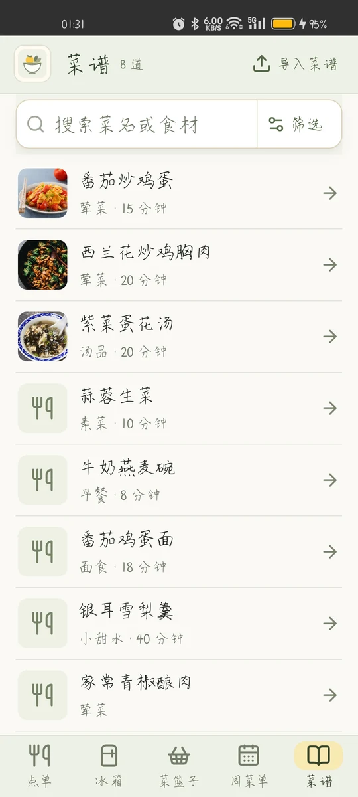
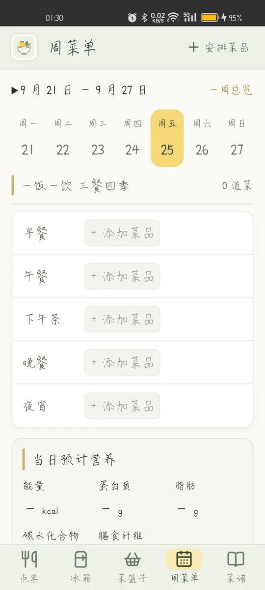
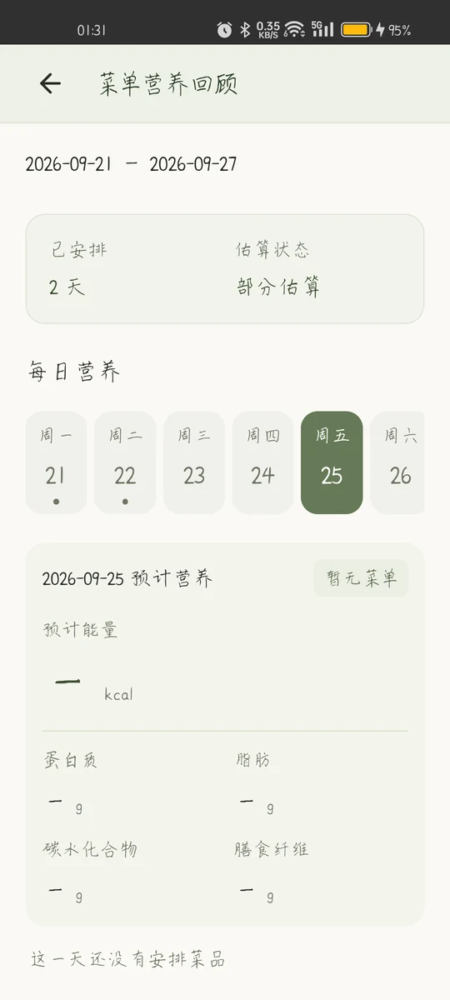
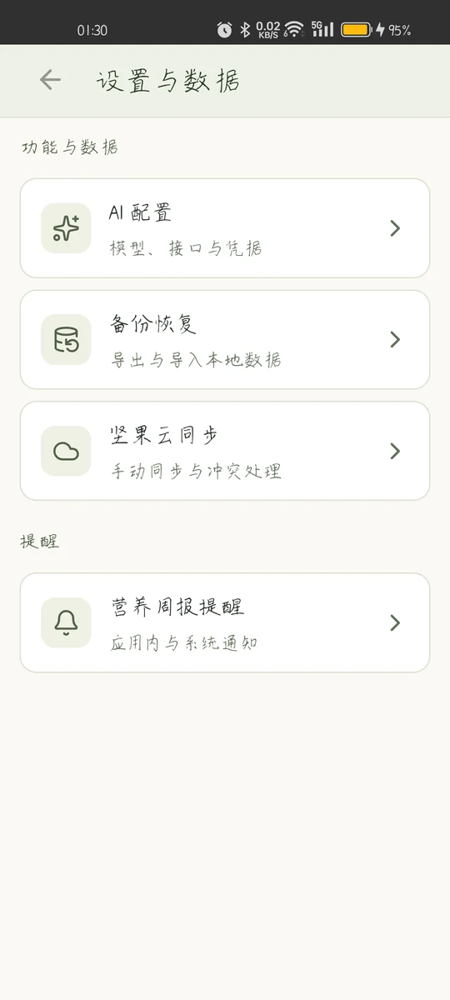

# 食光 · Android 本地膳食规划

React + Vite 高保真界面，通过 Capacitor 封装为 Android APK。核心菜谱、采购、周菜单和库存离线工作。V1.2.1 已实现独立识别入口、紧凑布局、五餐、参考保存期、菜单预计营养及双渠道周回顾提醒；真机覆盖安装、拍照回传及通知交互已验证；OPPO 后台定时提醒发现系统延迟，尚未通过可靠性验收，进度见 [V1.2.1 清单](docs/V1.2.1-TODO.md)。

当前本地交付版本 V2.0.1（npm / Android versionName 2.0.1，versionCode 7）：按确认的预览重排周菜单、营养回顾和设置，增加历史菜单做法快照、日期年月直达，并修复菜谱保存反馈及单张本地图片失效导致的整体加载失败。沿用 V1.2.3 原签名，已在测试机从 V1.2.3 保留数据覆盖升级；范围与未验项见 [整合评估](docs/用户体验与美学优化整合评估-2026-09-23.md) 和 [开发进度](docs/开发进度.md)。本地开发者版可用密码解锁 AI 配置；GitHub 公开版不含共享配置，需填写个人 AI Key。

需求见 [产品需求确认](docs/产品需求确认.md)，实施及验收见 [开发规划](docs/开发规划.md)，当前证据和外部待办见 [开发进度](docs/开发进度.md)。

## 运行界面


| 菜谱库 | 周菜单 |
| --- | --- |
| <a href="docs/screenshots/v2.0.1/recipes.webp"></a> | <a href="docs/screenshots/v2.0.1/week.webp"></a> |
| 营养回顾 | 设置与数据 |
| <a href="docs/screenshots/v2.0.1/nutrition.webp"></a> | <a href="docs/screenshots/v2.0.1/settings.webp"></a> |

## 本地开发

Node.js 22.12+。在项目根目录执行：

```powershell
npm install
npm run dev
npm run build
node --test src/*.test.js
```

浏览器预览仅用于开发，业务状态使用 localStorage；API Key 只保留在内存。Android 使用 SQLite、私有图片目录、SharedPreferences 和 Keystore。

## Android 构建

需要 JDK21、Android SDK36、Build Tools36，`android/local.properties` 指向 SDK，文件不提交。

```powershell
npm run build
npx cap sync android
cd android
.\gradlew.bat assembleDebug
```

APK 位于 `android/app/build/outputs/apk/debug/app-debug.apk`。本工作区工具放 `.android-tools/`，设置 `JAVA_HOME` 与 `GRADLE_USER_HOME` 到工作区相应路径后执行。构建不等于真机验收，详见进度文档。

本工作区执行 `./scripts/android-build.ps1`：使用 `.android-tools/jdk21/`、`.android-tools/sdk/`、`.android-tools/gradle-dist/gradle-8.13/` 和 `.android-tools/gradle-home-ascii/` 缓存离线构建，先核验原签名，再依次构建前端、同步 Capacitor、构建 APK 和运行单元测试，最后验证 APK 证书。连接设备后加 `-ConnectedTests` 运行 Android 仪器测试。所需工具和依赖缓存须提前准备。

debug 签名固定为 `.android-tools/android-home/legacy-debug.keystore`；在忽略文件 `.android-tools/signing.properties` 配置 `storePassword`、`keyAlias`、`keyPassword`，不得提交真实值。密钥、配置缺失或证书不符会阻止构建，不自动回退默认 debug 密钥。直接调用 Gradle 同样受证书校验约束；证书基准见 [AGENTS.md](AGENTS.md)。本地交付包为 `食光-V2.0.1.apk`，校验文件为 `食光-V2.0.1.apk.sha256`，两者均不纳入源码。

## 测试

- `node --test src/*.test.js`：采购、日期、迁移、备份、同步、保存期、营养快照与提醒日历。
- `python tests/e2e.py`：启动 Vite 后运行，覆盖核心浏览器流程。
- `python tests/e2e_ai.py`：AI模拟响应、错误、草稿、取消和手机导航。
- `python tests/e2e_mobile.py`：正式手机界面、分类搜索、份数与库存抵扣、按日菜单及总览、草稿恢复、历史快照、小屏与横屏布局。评审截图保留在 `.android-tools/mobile-review/`。
- `python tests/e2e_layout.py`：最终预览结构回归，检查冰箱横排分类、首屏库存、组合筛选、原批次编辑、共用搜索框与菜篮子样式隔离；截图保留在 `.android-tools/layout-fix/`。支持 `E2E_URL` 指向生产预览。
- 生产样式回归：先 `npm run build`、`npm run preview`，再设置 `$env:E2E_URL='http://127.0.0.1:4173'` 运行 `python tests/e2e_mobile.py`，包含弹窗正常高度/键盘压缩高度的边界检查。
- `python tests/android_upgrade.py prepare` / `verify`：经用户确认后用于专用真机升级验收，先备份再安装，验证结束恢复业务基线；设备可通过 `ANDROID_SERIAL` 指定。已有基线时拒绝覆盖，`.android-tools/v1.1-acceptance/` 备份可能含私有数据，不提交、不对外分享。
- `python tests/e2e_sync_startup.py`：在新启动的 Vite 开发服务器（默认 5173）上验证启动同步、居中确认、账号切换和下载期间本地修改保护；使用内存测试凭据，不连接真实网盘。
- `python tests/e2e_sync.py`：模拟 WebDAV 首次上传/下载、冲突备份与损坏数据保护，不代表真实坚果云验收。
- `python tests/e2e_confirm.py`：应用内业务确认、取消保留数据且不发请求、周安排覆盖、AI 授权/草稿、备份/云端副本恢复。默认生产预览 4173，可用 `E2E_URL` 指定；真机验收可设置 `ANDROID_ACCEPTANCE_DIR` 在 `.android-tools/` 下使用独立备份目录。
- Android：设备连接后 `android/gradlew.bat connectedDebugAndroidTest`（在 android 目录运行）。原生测试覆盖SQLite错误不覆盖、偏好、路径和图片类型等。
- 原生网络回归：构建 `:app:assembleDebugAndroidTest`，与应用使用相同证书签名后运行仪器测试；覆盖 WebDAV 方法、请求体/条件头、错误状态及禁止重定向。debug 仅为设备内测试开放 localhost/127.0.0.1 的明文 HTTP，release 不开放。
- V2.0.1 真机：设置 `ANDROID_SERIAL`、相对路径 `ANDROID_RELEASE_APK` 和全新 `ANDROID_RELEASE_DIR` 后运行 `python tests/android_release_upgrade.py`，先备份再覆盖安装；`ANDROID_UX_DIR` 指向全新日志目录后运行 `python tests/android_ux_v201.py`，只读核对主要页面、系统返回和键盘。升级脚本只用于已授权的专用测试机；安装前须按 AGENTS.md 启动日志采集。
- `python tests/android_sync_check.py`：必须得到用户授权，使用真机已保存的账户仅执行检查（包含创建同步目录的 MKCOL），不选择上传或恢复；不读取凭据，核对业务数据未变，结果写入 `.android-tools/webdav-acceptance/`。

浏览器测试输出留 `.android-tools/e2e/`，Python Playwright 和浏览器需可用；测试脚本将浏览器缓存限定到工作区。模拟服务测试不等于真实AI或坚果云账户验收。

## 使用与限制

- 设置与备份：配置 DeepSeek 接口及模型（当前官方文档模型 `deepseek-flash`），每次发送前确认文字与图片。
- AI提取只生成草稿，逐项编辑勾选后保存；失败保留输入。取消只停止等待，不保证服务端未计费。
- 公开链接正文复用 Mozilla Readability；小红书需要登录或返回空壳时改用粘贴/截图。暂不支持登录态评论抓取，不部署额外MCP服务。
- 坚果云：配置 WebDAV 根地址、账号和应用密码，支持启动自动同步（可关闭）及手动检查。首次连接或两端冲突时弹窗选择方向。双方变更不自动合并，恢复前保留本地备份；发布用条件写入，失败副本可恢复。
- PNG、HTML `.doc` 和 JSON 备份在 Android 通过系统文件保存；分享使用系统分享面板。
- 备份不含API Key、WebDAV密码和本机草稿。原型旧菜单ID迁移为快照，缺失内容明确标记。

## 开源与文档

- [Mozilla Readability](https://github.com/mozilla/readability)：Apache-2.0，公开网页正文提取。
- [DeepSeek 图像理解](https://api-docs.deepseek.com/zh-cn/guides/vision/)：Chat Completions 图文格式。
- [小红书 MCP](https://github.com/xpzouying/xiaohongshu-mcp)、[小红书 skill](https://github.com/DeliciousBuding/xiaohongshu-skill)：已评估，依赖外部浏览器/登录，不直接嵌入 APK。

不提交SDK、JDK、node_modules、dist、密钥及本地配置。本地开发者包与 GitHub 公开包分别构建；签名升级与真实服务验证结果以进度文档为准。

原生 HTTP 使用 OkHttp 4.12.0（Apache-2.0），仪器测试使用同版本 MockWebServer。网络诊断标签为 `ShiguangNetwork`，仅记录方法、阶段、状态码/异常类型，不记录 URL、凭据或正文。

## 开发者 AI 配置（V1.1.2）

入口位于“设置与数据 → AI 配置”下方。受控安装包内置整套配置的密文；输入约定密码启用，关闭后恢复个人配置。Android 将解锁结果写入独立 Keystore 加密槽，重启保持状态；不自动发起 AI 请求。

维护者可在已连接且打开食光的手机上执行 `python scripts/export-developer-profile.py --serial <设备序列号>`，按提示输入密码，只导出密文到被忽略的 `public/developer-ai-profile.json`。更新已有密文需显式加 `--replace`。打包前应保留此文件；缺失时开发者入口会提示不可用，个人配置仍可使用。不要将真实 Key、解锁密码或该密文提交 Git。

此方案不阻止安装包持有人离线猜测密码，也不支持逐设备撤销。轮换共享 Key 后需重新导出和打包。流程、测试和交付摘要见 [V1.1.2 交互修复](docs/V1.1.2交互修复.md)。

## GitHub 公开分发

公开仓库为 `MadebyNight/Savor`。源码不包含密文配置、API Key、签名密钥或本地数据。V2.0.1 公开版从 [GitHub Release](https://github.com/MadebyNight/Savor/releases/tag/v2.0.1) 下载 `Savor-v2.0.1-public.apk`，用同页的 `SHA256SUMS.txt` 核对；本地开发者版由维护者自行分发，不上传。

公开版必须从新的、干净的源码工作区执行 `npm run build:public` → `npx cap sync android` → Android `:app:assembleRelease`，然后使用维护者密钥签名。公开构建只复制白名单中的图片和字体资源，隐藏开发者入口，并忽略已有设备上的开发者凭据槽。不能用普通 `npm run build` 的输出代替公开版。

发布前核对 APK：不存在 `assets/public/developer-ai-profile.json`，无明文凭据、解锁密码或该密文内容，`debuggable=false`。保留原安装签名可以覆盖升级；公开版同样需要用户确认后才发送 AI 内容。

## V1.2.1 使用

- 菜谱 → 导入菜谱 → 图文或正文识别；冰箱 → 拍照识别。草稿按任务独立保留，设置仅配置服务。
- 库存新增/编辑选择保存方式；精确匹配的冷藏食材提供 FDA 参考期，包装/手动优先。未知、常温和冷冻保留待补充，冷冻品质建议不当成安全期限。
- 菜谱编辑中展开“整菜营养估算与可食克重”。单日五餐下默认显示预计营养；周菜单 → 本周菜单营养回顾可看每日分布、来源和缺失项，主动补充 AI 或生成周报。历史菜单重算需确认，报告过时会提示。
- 设置 → 营养周报提醒：两个开关共用星期/时间（默认周日 20:00，初始关闭）。前台应用内、后台系统通知；查看目标周回顾即停止该周提醒。Android 通知可能受节电影响，强行停止后需重新打开。通知不会自行请求 AI。
- 周报与营养快照进入业务备份/同步；提醒设置和通知状态只留本机。参考来源、许可、样本覆盖率见 [数据来源](docs/V1.2.1-数据来源.md)。

新增回归：`tests/e2e_recognition.py`、`tests/e2e_five_meals.py`、`tests/e2e_food_storage.py`、`tests/e2e_nutrition.py`、`tests/e2e_reminders.py`。后两者用开发入口注入隔离模拟数据，默认 Vite 5173；生产样式用 mobile/five_meals/interactions/food_storage 脚本，`E2E_URL` 指向 4173。测试先用 `Tee-Object` 保存输出至 `.android-tools/v1.2.1/`，真实设备操作先运行日志脚本。

Windows 中文路径若出现 Gradle 转换目录重命名失败，可使用临时 `S:` 映射、本地 Gradle 8.13 和 `.android-tools/gradle-home-ascii` 缓存；`android-build.ps1` 已使用本地 Gradle 与该缓存，但不自动创建盘符映射。V2.0.1 公开包来自干净工作区的 `build:public`、Android release 构建和原证书签名，验收范围见 [开发进度](docs/开发进度.md)。
