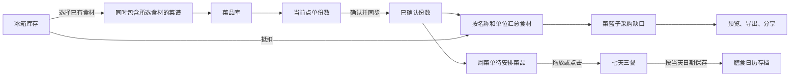

# 食光的视觉与交互逻辑

> 本文原型行为说明只作为历史记录；当前业务以产品需求确认为准：无热量、真实周自动保存、SQLite 本地数据、历史菜谱快照。视觉数值继续沿用。

基准是原站在 2026-09-13 提供的公开界面、CSS 与前端逻辑。复刻使用原始素材和样式数值，设计判断以原站实际呈现为准。

## 视觉语言

界面以米白和暖黄构成厨房氛围，食物照片承担主要视觉吸引力。灰绿用于辅助文案、食材提示和空白占位，黄色集中用于选中项、数量加号、确认操作与步骤编号。

| 用途                           | 原站数值                                 |
| ------------------------------ | ---------------------------------------- |
| 页面底色 / 正文                | `#fcfcf9` / `#292c26`                    |
| 卡片 / 侧栏                    | `#ffffff`                                |
| 主按钮 / 加号                  | `#f9cc4f` / `#f9cf52`                    |
| 导航选中 / 分类选中            | `#fff1b7` / `#fff0b7`                    |
| 提示横幅 / 边框                | `#fff7d9` / `#f4e8b6`                    |
| 通用边框                       | `#e9ebe3`                                |
| 字体                           | Microsoft YaHei、PingFang SC、sans-serif |
| 基础字号 / 主标题 / 二级标题   | 14px / 30px / 19px                       |
| 卡片圆角 / 横幅圆角 / 弹层圆角 | 16px / 17px / 20px                       |

原站前三道菜使用照片，后四道菜使用灰绿色餐具图标占位。复刻保留这种混合方式，图片裁切仍使用 `object-fit: cover`。

## 布局与信息层级

桌面布局由固定侧栏、77px 顶栏、页面标题、提示横幅和内容区组成。侧栏宽 224px；内容区最大宽 1500px，桌面左右内边距 40px。选菜页的分类栏占 125px，与菜品区域相隔 25px。

菜品卡片先展示食物与热量标签，再展示名称、食材、用时和份数加号。详情与加减份数是两个独立入口：点击照片或名称打开详情，加号直接加入点单清单。底部点单栏吸附在距视口底部 18px 的位置，持续显示当前已选数量。

| 屏幕范围      | 对应变化                                                                  |
| ------------- | ------------------------------------------------------------------------- |
| 大于 1200px   | 菜品三列，冰箱食材四列                                                    |
| 768–1200px    | 菜品两列，食材三列，正文内边距 28px                                       |
| 不大于 767px  | 侧栏变抽屉，顶栏 60px，主标题 24px，横向滚动分类，菜品两列，左右留白 17px |
| 不小于 1600px | 菜品图片高度由 165px 增至 210px                                           |

手机菜品图片高 125px。手机抽屉按原站实际 CSS 层叠占视口的 75%；周菜单保留至少 850px 的七天表格，在容器内横向滚动。

## 动作反馈

| 元素       | 表现                                                          |
| ---------- | ------------------------------------------------------------- |
| 按钮       | 背景与变形过渡 180ms，悬停亮度 0.97，禁用透明度 0.45          |
| 菜品卡片   | 悬停上移 3px，过渡 200ms，并出现淡阴影                        |
| 数量       | 初始仅显示黄色加号；选中后出现减号和份数                      |
| 底部点单栏 | 有选中数量时启用确认按钮                                      |
| 弹层       | 页面上方居中，最大宽 600px、最大高 85vh，内容超出时内部滚动   |
| 弹层背景   | 10% 黑色遮罩与背景模糊，内容淡入并从 95% 缩放进入，时长 100ms |
| 移动端抽屉 | 左侧进入，过渡 200ms，初始横向位移 -2.5rem                    |
| 提示消息   | 页面上方居中显示成功、失败或说明消息                          |
| 键盘       | Tab 焦点、Esc 关闭弹层、Ctrl / ⌘ + B 切换侧栏                 |

普通输入与按钮保留原站的黄色可见焦点边框。弹层的焦点约束与关闭由 Base UI 提供。

## 数据如何在页面间流动

当前点单份数与已确认份数相互独立。加减菜品只改变当前点单；点击确认后，菜篮子和周菜单的素材才同步更新。

采购清单以“食材名称 + 单位”为合并键：先按已确认份数累加需求，再抵扣相同名称及单位的冰箱库存，只展示大于零的缺口。分类以菜谱中对应食材的类别为准。

周菜单以 `0-早` 到 `6-晚` 的键保存餐次，每个餐次存放菜谱 ID，可重复安排同一道菜。待安排区域是一份菜品的模板，安排操作不会消耗点单份数，也不会自动扣除冰箱库存。

单份热量按 `每 100g 热量 × 成品重量 ÷ 100` 计算；先对餐次或每日的所有菜品求和，再四舍五入。标签以每 100g 为基准：低于 150 为低热量，150–400 为中热量，高于 400 为高热量。每日目标初始为 2000 kcal，遵循原站规则，仅在当前会话保留。

膳食日历使用保存当天日期作为存档键，当天再次保存会覆盖当天存档；清空本周不会清除历史存档。

冰箱按录入日期和设定保存天数估算剩余天数，录入当天算第 1 天。推荐菜谱采用同时满足规则：菜谱必须包含所有已选食材名称。此筛选不校验食材数量，也不表示已具备菜谱全部原料。

## 保留的原站边界

菜谱、冰箱、点单份数、已确认份数、当前周菜单和日期存档写入 `localStorage`。当前导航、筛选词、未保存的表单、弹层和每日目标不持久化。

图文、链接、拍照、小票识别均为入口占位，点击会说明识别服务尚未连接。菜谱营养值允许手动填写；没有自动营养核算服务。

本复刻包含原站当前提供的全部五个页面和八种弹层：详情、点单清单、添加食材、采购预览、清空确认、日期存档、导入菜谱、AI 识别食材。

## 画面对照资料

| 画面     | 原站                                            | 本地成品                             |
| -------- | ----------------------------------------------- | ------------------------------------ |
| 桌面选菜 | [参考图](reference/original-home.png)           | [预览图](preview/home.png)           |
| 菜谱详情 | [参考图](reference/original-detail.png)         | [预览图](preview/detail.png)         |
| 菜谱录入 | [参考图](reference/original-recipes.png)        | [预览图](preview/recipes.png)        |
| 菜篮子   | [参考图](reference/original-basket.png)         | [预览图](preview/basket.png)         |
| 周菜单   | [参考图](reference/original-week.png)           | [预览图](preview/week.png)           |
| 我的冰箱 | [参考图](reference/original-fridge.png)         | [预览图](preview/fridge.png)         |
| 手机选菜 | [参考图](reference/original-mobile.png)         | [预览图](preview/mobile.png)         |
| 手机导航 | [参考图](reference/original-mobile-sidebar.png) | [预览图](preview/mobile-sidebar.png) |

图片是交付的设计参考资料；本任务按要求未编写或运行功能测试。
热量计算已从当前产品范围移除，原型中的热量相关界面和计算属于待清理的旧原型能力。
